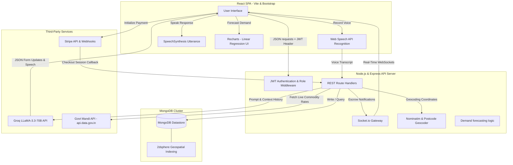

# Kisan – Farmer to Consumer Marketplace (Farm2Door)

[](https://nodejs.org/)
[](https://react.dev/)
[](https://www.mongodb.com/)
[](https://socket.io/)
[](https://stripe.com/)
[](https://groq.com/)
[](https://openstreetmap.org/)

Kisan is a full-stack, enterprise-grade Web application engineered to directly connect small-scale Indian farmers with urban/local consumers. By eliminating exploitative middlemen, Kisan guarantees fair crop pricing, real-time market transparency, and cryptographic payment trust. 

Designed with **rural accessibility** at its core, the platform integrates bilingual in-browser voice recognition, an LLM-driven voice form assistant, automated government market (Mandi) price warnings, cryptographic delivery validation, and client-side machine learning forecasting.

---

## 🏗️ System Architecture & Data Flow



---

## ⚡ Core Engineering & Architecture Highlights

### 1. 🎙️ Multilingual Voice-to-Form Assistant (Kisan Sahayak)
To remove literacy and technology barriers for rural farmers, Kisan features an interactive **AI Voice Assistant** mounted directly inside the listing form.
* **In-Browser Speech-to-Text & TTS**: Leverages the browser-native `SpeechRecognition` Web API to record audio stream transcripts. Utilizes the HTML5 `SpeechSynthesis` API to vocalize chatbot instructions back to the user.
* **LLM Form Parser**: Sends the transcript, form context, and crop lists to the server-side Groq LLaMA models. It uses a **model fallback chain** (`llama-3.3-70b-versatile` → `llama-3.1-8b-instant` → `mixtral-8x7b-32768`) to guarantee fast JSON response structure extraction under variable network conditions.
* **Phonetic & Location Reconciliation**: The prompt incorporates natural Hinglish/phonetic mappings (e.g. "Nashe ki" / "Minakshi" resolved dynamically to the "Nashik" crop district).
* **Automated Price Guard**: If the parsed voice command lists a crop price, the backend automatically hits the Government Mandi API (`api.data.gov.in`), retrieves current regional commodity pricing, and returns a warning to the farmer if their expected price is below market value.

```
Example voice input: "मराठी" language -> "५० किलो कांदा तीस रुपये प्रति किलो दराने नाशिक मध्ये विकायचा आहे"
AI Form Parser Output: 
{
  "updates": { "category": "Vegetables", "crop_name": "Onion", "quantity": 50, "price": 30, "village": "Nashik", ... },
  "speech": "कांदा उत्पादनाचे दर नाशिक मंडी मध्ये सरासरी ₹35 प्रति किलो आहेत. आपण ₹30 टाकला आहे, हा कमी आहे. पुढे जाऊ का?",
  "action": "upload_image"
}
```

### 2. 🔐 Cryptographic Escrow & Delivery Handshake (Zero-Trust)
To protect buyers from non-delivery and farmers from unpaid orders, the app implements a secure **Escrow Payment Lifecycle**:
1. **Secured in Escrow**: A consumer completes a checkout session (via Stripe Credit Card or Mock Simulation). The server flags the order status as `paid` and `escrowStatus` as `held`.
2. **Real-time Event Dissemination**: Stripe's webhook receives payment success and triggers a real-time event via Socket.io (`escrow_payment_secured`) directly to the farmer's dashboard.
3. **One-Time Password Generation**: The server generates a unique 6-digit delivery confirmation code for the buyer. Crucially, the backend stores it as a cryptographically salted bcrypt hash (`deliveryOTPHash`) with `select: false` on the database to prevent the farmer or database administrators from intercepting the code.
4. **Delivery Verification Handshake**: Upon physical delivery, the buyer gives the OTP to the farmer. The farmer inputs this OTP on their client. The server executes `bcrypt.compare(otp, deliveryOTPHash)`. 
5. **Release Escrow**: Only upon a positive match does the server release funds to the farmer, transition the order status to `completed`, and emit a `payment_released` Socket.io notification.

### 3. 📍 Geospatial Proximity Matchmaking
To support local micro-economies and minimize shipping fees, Kisan utilizes database-level geospatial processing:
* **Coordinates Enrichment**: Addresses are geocoded using the OpenStreetMap Nominatim API, transforming village/district names or pincodes into `[Longitude, Latitude]` coordinates.
* **2dsphere Indexes**: The MongoDB `Product` model indexes listing locations using the `2dsphere` format.
* **Proximity Sorting API**: Using Mongoose, consumers query listings using `$near` and `$geometry` operators, sorting crops by spatial distance and capping queries within a configurable radius.
```javascript
const maxDistanceMeters = radius * 1000;
const products = await Product.find({
    status: 'active',
    location: {
        $near: {
            $geometry: { type: 'Point', coordinates: [lng, lat] },
            $maxDistance: maxDistanceMeters
        }
    }
});
```

### 4. 📈 Mathematical Demand Forecasting Engine
Kisan integrates client-side analytical forecasting to help farmers decide what to plant next based on historical transactions.
* **Linear Regression Model**: Implements an Ordinary Least Squares (OLS) algorithm in JavaScript to compute the trend line ($y = mx + b$) of historical crop volumes over time.
* **Rolling Projections**: Projects future demand volume for a selected crop (e.g. Wheat, Rice, Tomato) for the next 6 months.
* **Sentiment Analysis**: Labels projected market trends as `High`, `Stable`, or `Low` by comparing forecasted values against historical averages.
* **Visualization**: Renders historical vs. forecasted trends dynamically using custom styled dashed-line charts in `recharts`.

---

## 🗄️ Database Models & Relationships

```
+-------------+         +-------------+         +-------------+
|    User     |1       *|   Product   |1       *|     Bid     |
|-------------+---------|-------------|---------|-------------|
| _id [PK]    |         | _id [PK]    |         | _id [PK]    |
| name, email |         | farmer_id   |         | product_id  |
| role        |         | crop_name   |         | consumer_id |
| village     |         | price       |         | bid_price   |
| district    |         | quantity    |         | status      |
+-------------+         | location    |         +-------------+
       |                +-------------+                |
       |                       |                       |
       | 1                     | 1                     | (Auto-forges
       |                       |                       |  on accept)
       +-----------+-----------+                       |
                   | *                                 v
            +-------------+                     +-------------+
            |    Order    |<--------------------|   Payment   |
            |-------------|1                   *|-------------|
            | _id [PK]    |                     | _id [PK]    |
            | consumer_id |                     | order_id    |
            | farmer_id   |                     | transaction |
            | final_price |                     | amount      |
            | order_status|                     | status      |
            | deliveryOTP |                     +-------------+
            +-------------+
```

---

## 🛣️ API Endpoints Summary

| Method | Endpoint | Auth | Description | Request Body / Query |
| :--- | :--- | :--- | :--- | :--- |
| **POST** | `/api/auth/register` | Public | Registers a new user (Farmer / Consumer) | `{ name, email, password, role, village, district, state }` |
| **POST** | `/api/auth/login` | Public | Logs in a user, returns a JSON Web Token (JWT) | `{ email, password }` |
| **GET** | `/api/products` | JWT | Gets all active products (supports geospatial radius filters) | `?lat=19.9&lng=73.7&radius=25` |
| **POST** | `/api/products` | JWT | Creates a new product listing (triggers geocoding) | `{ crop_name, quantity, price, sell_date, address: { isManual, pincode } }` |
| **POST** | `/api/bids` | JWT | Placed by consumer to negotiate product prices | `{ product_id, farmer_id, bid_price, requested_quantity }` |
| **PUT** | `/api/bids/accept/:id`| JWT | Accepts a bid (atomic quantity decrement, auto-forges order) | *None* |
| **POST** | `/api/payment/create-session`| JWT | Creates a Stripe Checkout session or falls back to simulation | `{ orderId, amount, productName }` |
| **POST** | `/api/payment/confirm-delivery`| JWT | Verification of delivery (OTP crypt handshake matching) | `{ orderId, otp }` |
| **POST** | `/api/ai/analyze-voice`| JWT | Voice recognition assistant form parsing and price advice | `{ transcript, formData, cropOptions, history, language }` |
| **POST** | `/api/chatbot` | JWT | KisanSetu AI RAG & routing chatbot (weather/mandi/navigation) | `{ question, role, language }` |

---

## 🛠️ Local Installation & Development Setup

### Prerequisites
* **Node.js** (v18.0.0 or higher recommended)
* **MongoDB** (running locally on `mongodb://localhost:27017` or MongoDB Atlas URI)

### Setup Server (Backend)
1. Navigate to the server folder:
   ```bash
   cd server
   ```
2. Install dependencies:
   ```bash
   npm install
   ```
3. Create a `.env` file in the `server` directory and add:
   ```env
   PORT=5000
   MONGO_URI=mongodb://localhost:27017/kisan
   JWT_SECRET=your_super_secret_jwt_key
   
   # AI & APIs
   GROQ_API_KEY=gsk_your_groq_api_key_here
   API_KEY=your_government_data_mandi_api_key_here
   WEATHER_API_KEY=your_openweathermap_api_key_here
   
   # Payments
   STRIPE_SECRET_KEY=sk_test_your_stripe_key
   STRIPE_WEBHOOK_SECRET=whsec_your_stripe_webhook_secret
   CLIENT_URL=http://localhost:5173
   ```
4. Seed mock mandi and crop products data:
   ```bash
   npm run seed
   ```
5. Start development backend:
   ```bash
   npm run dev
   ```

### Setup Client (Frontend)
1. Navigate to the client folder:
   ```bash
   cd ../client
   ```
2. Install dependencies:
   ```bash
   npm install
   ```
3. Start development Vite client:
   ```bash
   npm run dev
   ```
4. Access the web dashboard at `http://localhost:5173`.

---

## 💡 Key Skills & Engineering Best Practices Demonstrated
* **Race Conditions & Concurrency Controls**: Uses atomic MongoDB queries (`findOneAndUpdate` with `$inc` and `$gte`) during bid acceptance to prevent double-selling of fragment inventory in concurrent environments.
* **Zero-Trust Security**: Uses secure cryptographic hashes (`bcrypt`) to verify OTPs before triggering database updates to release financial escrows.
* **Polymorphic Search**: Custom conversational router routes requests based on intent classification (e.g. Navigation Intents vs. Live Mandi Intents vs. Live Weather API query).
* **Fault-Tolerant Network Logic**: Fallback chains across three LLaMA model sizes, and offline database fallback caches if Government APIs time out or miss access keys.
